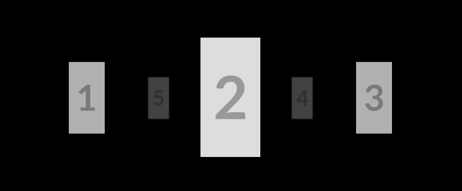

# Perspective Carousel



## Xbox Console Shopping Demo

Demo of using `<perspective-carousel>` and Azure OpenAI GPT-4o to build an Xbox console shopping experience

```bash
npm i
npm run dev

# Open http://localhost:5173
```

## Quickstart

```html
<script src="https://esm.sh/gh/chuanqisun/perspective-carousel@0.0.5/src/lib.ts" type="module"></script>

<style>
  @import url("https://esm.sh/gh/chuanqisun/perspective-carousel@0.0.5/src/lib.css");
</style>

<button id="prev">Prev</button>
<button id="next">Next</button>

<div class="container" style="width: 100vw; height: 50vh">
  <perspective-carousel fade-mode="lighten">
    <carousel-item>
      
    </carousel-item>
    <carousel-item>
      
    </carousel-item>
    <carousel-item>
      
    </carousel-item>
    <carousel-item>
      
    </carousel-item>
    <carousel-item>
      
    </carousel-item>
  </perspective-carousel>
</div>

<script>
  document.getElementById("next").onclick = () => document.querySelector("perspective-carousel").rotateByOffset(1);
  document.getElementById("prev").onclick = () => document.querySelector("perspective-carousel").rotateByOffset(-1);
</script>
```

## Element APIs

> [!IMPORTANT]
> The carousel can only support 3, 4, or 5 items. It looks the best with 3 or 5 items.

```html
<perspective-carousel>
  <carousel-item> Item 1 </carousel-item>
  <carousel-item> Item 2 </carousel-item>
  <carousel-item> Item 3 </carousel-item>
</perspective-carousel>

<!-- Fade effect on dark background -->
<perspective-carousel fade-mode="darken">
  <carousel-item> Item 1 </carousel-item>
  <carousel-item> Item 2 </carousel-item>
  <carousel-item> Item 3 </carousel-item>
</perspective-carousel>

<!-- Fade effect on light background -->
<perspective-carousel fade-mode="lighten">
  <carousel-item> Item 1 </carousel-item>
  <carousel-item> Item 2 </carousel-item>
  <carousel-item> Item 3 </carousel-item>
</perspective-carousel>
```

```typescript
const carousel = document.querySelector("perspective-carousel") as PerspectiveElement;

/** Rotate the carousel by a number of stops. */
carousel.rotateByOffset(relativeStops: number): void;

/** Rotate the carousel to a specific index. */
carousel.rotateToIndex(absoluteIndex: number): void;

/** Rotate the carousel to a specific element (or the <carousel-item> that contains the element. */
carousel.rotateToElement(targetElement: HTMLElement): void;

/** Query current focus element */
console.log(carousel.focusedItem);

/** Handle events */
carousel.addEventListener("rotatestart", (event) => {
  /** The old and new <carousel-item> elements */
  const { oldFocus, newFocus } = event.detail;
});

carousel.addEventListener("rotateend", (event) => {
  const { oldFocus, newFocus } = event.detail;
});
```
